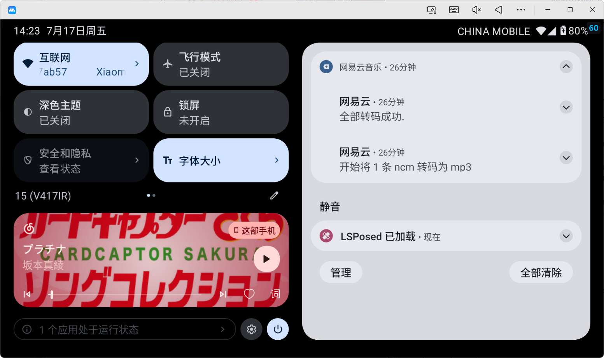

# 一个自动将网易云 ncm 格式解码为 mp3 的 Lsposed 模块

hook 了网易云的主进程, 打开网易云时, 会扫描网易云默认下载路径下的 `ncm` 文件, 将其解码为 `mp3` 文件, 并删除源 `ncm` 文件

## 效果预览

## 已知问题

+   使用了 [NCM2MP3](https://github.com/charlotte-xiao/NCM2MP3), 该库为桌面库, 引用了 `javax.imageio.ImageIO` 包用于解析封面. 由于该包不能在 Android 平台上运行, 因此解析时会抛出 `java.lang.NoClassDefFoundError` 异常. 现在仅仅是忽略该异常, 导致转码后的 `mp3` 文件没有封面.

    >   1.0~
    >   下一步开发会尝试分支原始库用 Android Runtime API 替代原始逻辑

## 第三方库和许可

+   [NCM2MP3](https://github.com/charlotte-xiao/NCM2MP3) 主要转码逻辑实现
+   [ALSModuleDemo](https://github.com/1750-shocker/ALSModuleDemo) 项目框架, [MIT](https://github.com/1750-shocker/ALSModuleDemo/blob/main/LICENSE)
